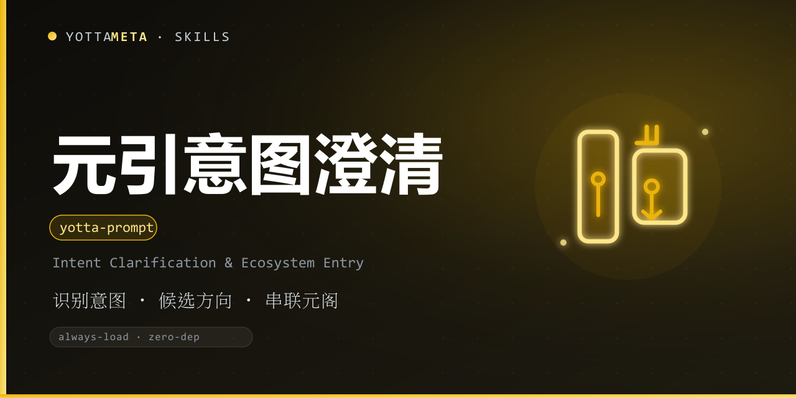

<p align="center"><b>Language</b>: English · <a href="./README.zh-CN.md">中文</a></p>

<p align="center">
  
</p>

<h1 align="center">yotta-prompt · 元引 (YuanYin)</h1>

<p align="center">YottaMeta's <b>intent-clarification &amp; ecosystem-entry</b> skill: when a user types a vague phrase or a single word, it identifies the intent, offers <b>2-4 candidate directions</b>, deep-dives into goal / scope / output, then routes to the matching YottaMeta skill and outputs a <b>ready-to-run prompt</b>.</p>
<p align="center">Activates when the user does not know how to prompt AI, does not know what they want, or says something vague — <b>always-load at session start</b>, so it catches users who would never trigger a skill on their own.</p>
<p align="center">No external tools required (Python 3.8+ standard library); Windows + Linux + macOS; fully local and offline — no network calls, no external services.</p>

<p align="center">
  <a href="LICENSE"></a>
  <a href="https://agentskills.io/"></a>
  <a href="https://www.npmjs.com/package/@yottameta/yotta-prompt"></a>
  <a href="https://github.com/YottaMeta/yotta-prompt"></a>
  <a href="https://github.com/YottaMeta/yotta-prompt/commits/main"></a>
  <a href="https://github.com/YottaMeta/yotta-prompt"></a>
</p>

## What it is

Many users do not know how to talk to an AI: they type a vague phrase or a single word and expect help, but they cannot say what they want. YuanYin is the **front door** of the YottaMeta skill family: it turns "I have no idea how to ask" into "here is a task that can actually run".

It follows a five-step flow: **1) identify intent → 2) offer 2-4 candidate directions → 3) confirm → 4) deep-dive (goal / scope / output / constraints) → 5) route to the matching YottaMeta skill and output a ready-to-run prompt.**

It is not a prompt beautifier. Prompt polishing is a red ocean; YuanYin only clarifies intent and connects users to the right skill.

## Core value

- **Intent clarification, not prompt polishing** — turns vague words into executable tasks; never jumps to conclusions on step 1.
- **Ten intent domains** — development / data / planning / memory / security / logs / learning / writing / quality / general, with Chinese + English keyword scoring (fully local). Industry-agnostic: works for weekly reports, spreadsheets, plans, speeches, translation, meeting notes, contracts, brainstorming, interview prep and more.
- **Skill-name locking** — mentions of `yotta-*` or a Chinese family name (元忆 / 元安 / …) pin that direction immediately.
- **Ecosystem entry** — maps every direction to the matching YottaMeta skill with its Chinese name, one-liner and install command.
- **Ready-to-run prompts** — each domain ships a prompt template you can fill in and run.
- **Scenario library** — 18 built-in walkthroughs across any industry (vague input → candidates → deep-dive → routing), see `references/scenarios.md`.

## Why use it

| Advantage | Description |
|---|---|
| **Always-load** | `always-load: true` at session start; catches users who would never manually load a skill |
| **Zero dependency** | Python 3.8+ standard library; no daemon / database / network; Windows + Linux + macOS |
| **Fully local offline** | Intent classification and mapping run locally; no external calls |
| **Works with zero skills installed** | Prompts are self-contained behavior descriptions; YottaMeta skills are optional accelerators, never a hard dependency |
| **Honest boundaries** | Clarification only — no preset stance, no safety review; prompts have no artificial limits (never violating laws / jailbreaking) |
| **Ecosystem distribution** | GitHub + npm + ClawHub synced; install via npx / install.sh / manual copy |

## Commands

| Command | Description |
|---|---|
| clarify | One vague phrase / word → 2-4 candidate directions with Chinese explanations |
| clarify --json | Structured candidates for programmatic use |
| clarify --top N | Limit candidate count (2-4, default 4) |
| map | Direction or skill name → YottaMeta skills + install commands + ready-to-run prompt |
| map --json | Structured mapping result |
| scenarios | List built-in scenario cases |
| --version | Print version |

## Usage

Windows uses `python`, Linux/macOS uses `python3`.

```bash
# Clarify a vague phrase into 2-4 candidate directions
python3 scripts/yotta_prompt.py clarify "help me write an email"

# JSON output for programmatic consumption
python3 scripts/yotta_prompt.py clarify "remember this" --json

# Limit the number of candidates
python3 scripts/yotta_prompt.py clarify "how do I learn python" --top 3

# Map a direction / skill name to YottaMeta skills, install commands and a runnable prompt
python3 scripts/yotta_prompt.py map writing
python3 scripts/yotta_prompt.py map yotta-humanize --json

# Built-in scenario cases
python3 scripts/yotta_prompt.py scenarios
```

Exit codes: **0** = success; **1** = not recognized (guidance printed); **4** = usage or read error.

Sample text output:

```
元引 yotta-prompt v0.1.0 —— 意图澄清
输入：「帮我写一封邮件」

我猜你想做这几件事（回复数字选择，或直接说出你的选择）：

1. 写作与语言（writing）
   · 命中关键词：邮件
   · 可串联：元真 yotta-humanize
2. 通用与入门（general）
   · 还没想清楚，先从通用引导开始
```

## Installation

Pick any of the three methods; skill files are always fetched from **npm** (GitHub can be slow without a proxy; npm supports mirrors).

### Method 1: npm (recommended, one-liner)
```bash
# Optional China mirror: npm config set registry https://registry.npmmirror.com
npx -y @yottameta/yotta-prompt -g
npx -y @yottameta/yotta-prompt --dir <your skills dir>   # any agent: install to a custom directory
```
> Agent not in the preset list? Use `--dir` to point at its skills directory, or copy manually (Method 3). `--list` shows the default directory of each agent.

### Method 2: install.sh
After obtaining the skill folder (`npm pack` unpack or `git clone`), enter the folder:
```bash
bash install.sh -g    # user-level; bash install.sh --list shows all directories
bash install.sh --agent codex   # a specific agent (see --list)
bash install.sh       # project-level: auto-detect existing skills directories
bash install.sh --dir /path/to/skills
```
> Covers 17 agent families, including Trae / Qwen / Comate / CodeBuddy / Kimi.

### Method 3: manual copy
Copy the whole `yotta-prompt` folder into the target agent's skills directory. Common user-level locations (`%USERPROFILE%` on Windows, `~` on Linux/macOS):

| Agent | User-level directory | Project-level directory |
|---|---|---|
| Codex | `%USERPROFILE%\.codex\skills\yotta-prompt\` | `.codex\skills\` |
| Claude Code | `%USERPROFILE%\.claude\skills\yotta-prompt\` | `.claude\skills\` |
| Cursor | `%USERPROFILE%\.cursor\skills\yotta-prompt\` | `.cursor\skills\` |
| Windsurf | `%USERPROFILE%\.codeium\windsurf\skills\yotta-prompt\` | `.windsurf\skills\` |
| opencode | `%USERPROFILE%\.config\opencode\skills\yotta-prompt\` | `.opencode\skills\` |
| Gemini | `%USERPROFILE%\.gemini\skills\yotta-prompt\` | `.gemini\skills\` |
| Goose | `%USERPROFILE%\.config\goose\skills\yotta-prompt\` | `.goose\skills\` |
| Amp | `%USERPROFILE%\.config\agents\skills\yotta-prompt\` | `.agents\skills\` |
| Kiro | `%USERPROFILE%\.kiro\skills\yotta-prompt\` | `.kiro\skills\` |
| WorkBuddy | `%USERPROFILE%\.workbuddy\skills\yotta-prompt\` | `.workbuddy\skills\` |
| Trae Code CLI | `%USERPROFILE%\.traecli\skills\yotta-prompt\` | `.traecli\skills\` |
| Trae IDE (CN) | `%USERPROFILE%\.trae-cn\skills\yotta-prompt\` | `.trae\skills\` |
| Qwen Code | `%USERPROFILE%\.qwen\skills\yotta-prompt\` | `.qwen\skills\` |
| Comate | `%USERPROFILE%\.comate\skills\yotta-prompt\` | `.comate\skills\` |
| CodeBuddy | `%USERPROFILE%\.codebuddy\skills\yotta-prompt\` | `.codebuddy\skills\` |
| Kimi | `%USERPROFILE%\.kimi\skills\yotta-prompt\` | `.kimi\skills\` |
| Generic AGENTS.md | `%USERPROFILE%\.agents\skills\yotta-prompt\` | `.agents\skills\` |

> If Codex's `CODEX_HOME` is set, it overrides the default; the same applies to opencode's `XDG_CONFIG_HOME`. `.agents\skills` is not a universal directory — only OpenCode / Cursor / Cline / Amp / Kimi / Gemini CLI / GitHub Copilot etc. read it; **Claude Code and Codex do not read it by default**. When unsure, use `--dir` or let the agent install it.

## Development & validation

The package ships its own test script (included in the published package):

```bash
# Run the full suite (41 cases) from the skill directory
python scripts/test_yotta_prompt.py
```

The scenario walkthroughs live in `references/scenarios.md`.

## License

MIT © YottaMeta — see [LICENSE](./LICENSE).
